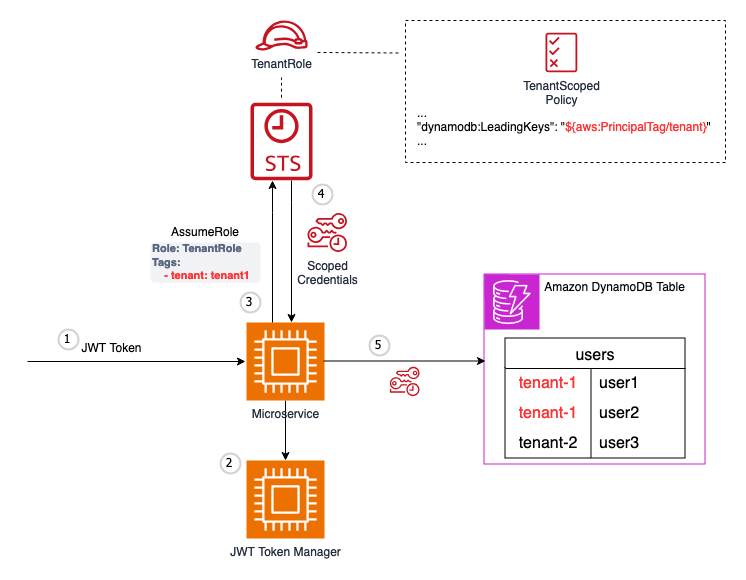

# DynamoDB pooled isolation

This example illustrates a secure approach to implementing item-level security in Amazon DynamoDB. This solution leverages scoped IAM credentials, and conditional access policies to ensure that each tenant can only access and modify data that belongs to them, while leveraging a single DynamoDB table for all tenants. By following this approach, SaaS providers can efficiently manage and secure tenant data, reducing operational overhead while ensuring tenant isolation and compliance with privacy and security requirements.

## Components

1. **JWT Token**: A JSON Web Token (JWT) is issued to the user or client application, which contains information about the tenant they belong to. This is included in the authorization header in the request. 

2. **JWT Token Manager**: The JWT Token Manager is responsible for validating and managing the JWT tokens issued to clients and parsing the claims as part of the tenant context.

3. **Microservice**: The microservice receives the JWT token from the client and performs the following actions:
   - Assumes the `TenantRole` by providing the `Role` and `TenantId` tags from the JWT token.
   - Obtains Scoped Credentials based on the assumed `TenantRole`.

4. **STS (AWS Security Token Service)**: The AWS Security Token Service (STS) is used to assume the `TenantRole` and obtain Scoped Credentials for the microservice. These scoped credentials only grant access to items where the partition key begins with the tenantId supplied in the tenant context.

5. **Amazon DynamoDB Table**: The microservice uses the Scoped Credentials to access the Amazon DynamoDB table and perform operations based on the tenant's access permissions. The DynamoDB table contains data partitioned by tenant, with items belonging to different tenants (e.g., `tenant-1` and `tenant-2`).

The key components in this architecture are:

- **TenantRole**: An AWS Identity and Access Management (IAM) role which via session tags grants permissions to access only the data belonging to that tenant.
- **TenantScoped Policy**: An IAM policy attached to the `TenantRole`, which defines the access permissions for the tenant. The policy uses the `dynamodb:LeadingKeys` condition key to restrict access based on the tenant identifier (`${aws:PrincipalTag/tenant}`).
- **Amazon DynamoDB Table**: A DynamoDB table that stores data for multiple tenants, with each item containing a tenant identifier (e.g., `tenant-1`, `tenant-2`) to distinguish the data belonging to different tenants.

The primary goal of this architecture is to implement item-level security in DynamoDB by ensuring that each tenant can only access and modify data that belongs to them, while leveraging a single DynamoDB table for all tenants. This is achieved through the use of scoped IAM credentials, and conditional access policies based on the tenant identifier.