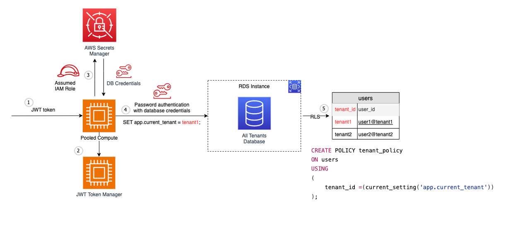

# Relational database pooled isolation

In this example a pooled partitioning model is used for both the compute and the database. In this scenario, data isolation is enforced at the database level rather than at the network or IAM level. In practice, this is achieved by using [PostgreSQL Row Level Security policies](https://www.postgresql.org/docs/9.5/ddl-rowsecurity.html). This policy evaluates a session variable set based on the tenant context. This variable is then used to filter all result sets to only show results for that tenant. The tenant is retrieved via the JWT token passed to the microservice. As a best practice, in a production application you should also include these query filters ("WHERE" clauses) rather than relying solely on the RLS policy in order to provide an extra layer of protection against a misconfiguration.



## Components

1. **JWT Token**: The process begins with a JSON Web Token (JWT) provided for authentication.

2. **JWT Token Manager**: The JWT token is validated and managed by the JWT Token Manager component.

3. **Assumed IAM Role**: An AWS Identity and Access Management (IAM) role is assumed, which provides temporary security credentials to access the AWS Secrets Manager securely.

4. **AWS Secrets Manager and Password Authentication**: Using the assumed IAM role's credentials, the application retrieves the database credentials from AWS Secrets Manager. These credentials are then used to authenticate with the RDS instance using password authentication.

   * Additionally, during this step, the application sets the `app.current_tenant` variable based on the authenticated tenant's ID using the following SQL command:

   ```sql
   SET app.current_tenant = tenant1;
   ```

5. **RDS Instance and Row-Level Security (RLS)**: The data for all tenants is stored in a single database. Row-Level Security (RLS) is implemented using a policy named `tenant_policy` defined on the `users` table. This policy ensures that each tenant can only access rows where the `tenant_id` matches the current tenant ID set by the application in step 4.

   The `tenant_policy` is created using the following SQL statement:

   ```sql
   CREATE POLICY tenant_policy
   ON users
   USING (
       tenant_id = (current_setting('app.current_tenant'))
   );
   ```

   The `users` table contains columns for `tenant_id`, `user_id`, and potentially other user-specific data. 

This approach allows for multi-tenant isolation within a single database by leveraging PostgreSQL's Row-Level Security feature and securely managing database credentials using AWS Secrets Manager.

For more details see [Choose the right PostgreSQL data access pattern for your SaaS application](https://aws.amazon.com/blogs/database/choose-the-right-postgresql-data-access-pattern-for-your-saas-application/)