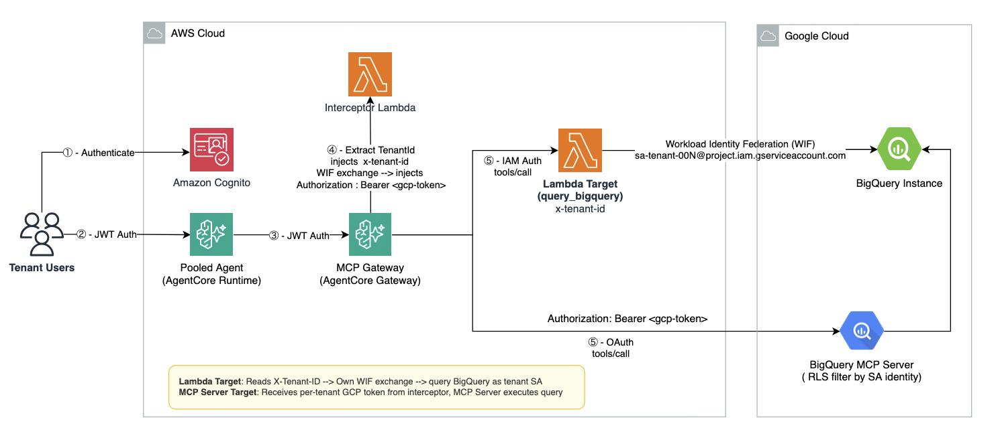

# Multi-Tenant AI Agent with BigQuery Row-Level Security

A pattern for multi-tenant AI agents accessing Google BigQuery through Amazon Bedrock AgentCore, with per-tenant data isolation enforced by BigQuery Row-Level Security (RLS) and cross-cloud authentication via GCP Workload Identity Federation (WIF).

## Pattern Overview

This sample demonstrates how a SaaS provider can deploy an AI agent that serves multiple tenants, each with isolated access to their own data in Google BigQuery without storing any GCP secrets on the AWS side.

**Two integration paths are shown:**

| Target Type | How It Works | Best For |
|-------------|-------------|----------|
| **Lambda target** | Custom Lambda performs WIF exchange internally | Full control, custom SQL logic, multi-step workflows |
| **MCP Server target** | Interceptor performs WIF, injects token for Google's managed BigQuery MCP Server | Zero-code integration, rapid time-to-value |

Both achieve identical tenant isolation through the same underlying mechanism: per-tenant GCP service accounts + BigQuery RLS.

## Architecture



## Key Concepts

### Zero-Secret Cross-Cloud Auth (Workload Identity Federation)

No GCP service account keys are stored anywhere. The Lambda/interceptor's AWS IAM role is exchanged for a short-lived GCP token at runtime:

```
AWS IAM credentials → GCP STS (token exchange) → Impersonate per-tenant SA → Access token (1hr)
```

### Template-Based Tenant Resolution

A single WIF config template serves unlimited tenants. The `{tenant_id}` placeholder is replaced at runtime:

```json
// lambda/wif_config.template.json (01_setup_wif.sh generates per-Lambda copies)
{
  "GCP_PROJECT_ID": "<YOUR_GCP_PROJECT_ID>",
  "wif_template": {
    "type": "external_account",
    "audience": "//iam.googleapis.com/projects/<YOUR_GCP_PROJECT_NUMBER>/locations/global/workloadIdentityPools/aws-saas-pool/providers/aws-provider",
    "subject_token_type": "urn:ietf:params:aws:token-type:aws4_request",
    "token_url": "https://sts.googleapis.com/v1/token",
    "credential_source": {
      "environment_id": "aws1",
      "regional_cred_verification_url": "https://sts.{region}.amazonaws.com?Action=GetCallerIdentity&Version=2011-06-15",
      "imdsv2_session_token_url": "http://169.254.169.254/latest/api/token"
    },
    "service_account_impersonation_url": "https://iamcredentials.googleapis.com/v1/projects/-/serviceAccounts/sa-{tenant_id}@<YOUR_GCP_PROJECT_ID>.iam.gserviceaccount.com:generateAccessToken"
  }
}
```

Adding a new tenant = create GCP SA + add RLS policy. No AWS config changes needed.

### BigQuery RLS (Deny-by-Default)

```sql
CREATE ROW ACCESS POLICY tenant_001_orders
ON `project.dataset.orders`
GRANT TO ("serviceAccount:sa-tenant-001@project.iam.gserviceaccount.com")
FILTER USING (tenant_id = 'tenant-001');
```

Once applied, any identity WITHOUT an explicit policy grant sees **zero rows**. Even a misconfigured agent can't leak data.

## Prerequisites

- **AWS Account** with permissions to create Lambda, IAM, Cognito, and AgentCore resources
- **AWS CLI** configured with credentials for your target account. Either:
  - Run `aws configure` to set up default credentials, or
  - Use a named profile: `export AWS_PROFILE=your-profile-name`
  - Verify with: `aws sts get-caller-identity`
- **GCP Account** with a project (BigQuery API enabled, billing linked)
- **AWS CDK v2** (`npm install -g aws-cdk`)
- **Python 3.12+**
- **Container runtime** — [Finch](https://github.com/runfinch/finch) or Docker (CDK builds the agent container image)
- **`gcloud` CLI** authenticated to your GCP project
- **Node.js 18+**

## Deploy

### Step 1: Clone the Sample

```bash
git clone https://github.com/aws-samples/data-for-saas-patterns.git
cd data-for-saas-patterns/samples/multi-tenant-agent-bigquery-rls
```

### Step 2: Create Workload Identity Federation (Cross-Cloud Trust)

Establishes trust between your AWS account and GCP project. Also generates the `wif_config.json` files used by the Lambda functions at runtime.

```bash
cd scripts
export GCP_PROJECT_ID=YOUR_GCP_PROJECT_ID
bash 01_setup_wif.sh
```

**What this creates:**
- Enables required GCP APIs (IAM, STS, IAM Credentials, BigQuery)
- Creates a Workload Identity Pool (`aws-saas-pool`) — the trust boundary
- Adds an AWS provider to the pool — tells GCP "trust tokens from this AWS account"
- Generates `lambda/bigquery_query/wif_config.json` and `lambda/interceptor/wif_config.json` with your project values

**Key insight:** The WIF pool trusts the entire AWS account, but impersonation of specific GCP SAs requires an additional per-SA binding (Step 5). This is defense-in-depth: account-level trust + SA-level authorization.

---

### Step 3: Build Lambda Layers

```bash
cd ..
bash scripts/02_build_layers.sh
```

This builds the Python dependencies (google-cloud-bigquery, google-auth, PyJWT) as Lambda layers targeting Linux x86_64.

---

### Step 4: Deploy AWS Resources (CDK)

```bash
cd cdk
python3 -m venv .venv && source .venv/bin/activate
pip install -r requirements.txt
export CDK_DOCKER=finch  # or docker
cdk deploy --all
```

This creates:
- Cognito User Pool with test users (tenant-001, tenant-002)
- AgentCore Gateway with Cognito JWT authorizer
- Interceptor Lambda (dual-mode: header injection + WIF exchange)
- BigQuery Query Lambda + layer + IAM execution role
- Gateway targets (Lambda + MCP Server)
- AgentCore Runtime with Strands Agent container (ARM64)

---

### Step 5: Create Per-Tenant Service Accounts

Each tenant gets a dedicated GCP service account. The SA's identity IS the tenant boundary — BigQuery RLS (Step 7) binds row access to these identities.

```bash
cd ../scripts
bash 03_setup_service_accounts.sh
```

**What this creates per tenant:**
- GCP service account (`sa-tenant-001@project.iam.gserviceaccount.com`)
- BigQuery roles: `dataViewer`, `jobUser`, `user`, `mcp.toolUser`
- WIF binding: allows the Lambda IAM role to impersonate this SA
- WIF binding: allows the Interceptor IAM role to impersonate this SA

**Key insight:** No GCP secrets are generated. The WIF binding says "IAM role X can become SA Y" — the actual credential exchange happens at runtime using the Lambda's own IAM credentials.

---

### Step 6: Create BigQuery Tables and Sample Data

Creates shared multi-tenant tables with a `tenant_id` column and inserts sample data. At this point there is NO isolation — any authenticated identity can see all rows.

```bash
bash 04_setup_bigquery_data.sh
```

**What this creates:**
- Dataset: `saas_pilot`
- Table: `orders` (5 rows — 3 for tenant-001, 2 for tenant-002)
- Table: `customer_data` (3 rows — 2 for tenant-001, 1 for tenant-002)

**Key insight:** The `tenant_id` column is metadata, not a security boundary. Without RLS (Step 7), it's just a regular column with no enforcement. Any query sees all rows regardless of who's asking.

---

### Step 7: Apply Row-Level Security (The Isolation Boundary)

This is the critical step that creates the hard security boundary. Once applied, each service account can ONLY see rows where `tenant_id` matches their grant. Any unmapped identity sees zero rows.

```bash
bash 05_setup_rls.sh
```

**What this creates per tenant per table:**
```sql
CREATE ROW ACCESS POLICY tenant_001_orders
ON `project.saas_pilot.orders`
GRANT TO ("serviceAccount:sa-tenant-001@project.iam.gserviceaccount.com")
FILTER USING (tenant_id = 'tenant-001');
```

**Key insight:** RLS is deny-by-default. Once a single policy exists on a table, any identity NOT covered by a policy sees zero rows — not all rows. This means:
- `sa-tenant-001` → sees 3 rows (tenant-001 only)
- `sa-tenant-002` → sees 2 rows (tenant-002 only)
- Any other identity → sees 0 rows (even if they have `dataViewer` role)

The agent writes `SELECT * FROM orders` — same SQL for all tenants. RLS filters based on WHO is asking.

---

### Step 8: Test Lambda Target

Test the Lambda target path: Gateway → Interceptor (injects x-tenant-id) → Lambda (WIF exchange) → BigQuery (RLS).

```bash
bash 06_test_lambda_target.sh
```

Sends the same SQL as two different tenants and verifies different data is returned:

```
tenant-001: 3 rows (expected: 3)
tenant-002: 2 rows (expected: 2)
✅ PASS — Same SQL, different data. Lambda target RLS isolation confirmed.
```

---

### Step 9: Test MCP Server Target

Test the MCP Server target path: Gateway → Interceptor (WIF exchange + token injection) → BigQuery MCP Server (RLS).

```bash
bash 07_test_mcp_target.sh
```

Uses Google's managed BigQuery MCP Server — no custom Lambda code in the query path:

```
tenant-001: 3 rows (expected: 3)
tenant-002: 2 rows (expected: 2)
✅ PASS — Same SQL, different data. Zero custom code in the path.
```

**Key difference from Lambda path:** The interceptor does the WIF exchange (not the target). No custom code exists in the query execution path.

---

### Step 10: Test Agent with Natural Language

Test the full agent experience: natural language → Strands Agent → AgentCore Gateway → BigQuery tools → tenant-isolated results.

```bash
bash 08_test_agent.sh
```

Sends the same natural language prompt as two different tenants via the AgentCore Runtime:

```
─── Tenant-001 ───
  Prompt: How many orders do I have?
  Agent: You have **3 orders** in total.

─── Tenant-002 ───
  Prompt: How many orders do I have?
  Agent: You have **2 orders** in total.

✅ Multi-tenant agent verified.
```

**What's happening:**
1. Agent receives natural language prompt + tenant JWT (forwarded by Runtime's `requestHeaderAllowlist`)
2. Agent connects to Gateway as an MCP client using the JWT
3. Agent decides to call the BigQuery query tool (LLM reasoning)
4. Gateway → Interceptor → Lambda/MCP Server → WIF → BigQuery → RLS → filtered results
5. Agent formats results in natural language

The agent code is completely **tenant-unaware**. It never references tenant IDs, doesn't filter data, and uses the same system prompt for all tenants. Isolation is invisible to the LLM.

## Project Structure

```
├── agent/
│   ├── app.py                         # Strands Agent (connects to Gateway as MCP client)
│   ├── Dockerfile                     # Container for AgentCore Runtime (ARM64)
│   └── pyproject.toml                 # Agent dependencies (uv-managed)
├── cdk/
│   ├── app.py                         # CDK app entry point
│   ├── cdk.json                       # CDK config
│   ├── requirements.txt               # Python CDK dependencies
│   └── stacks/
│       └── multi_tenant_bigquery_stack.py  # Single consolidated stack
├── lambda/
│   ├── wif_config.template.json       # WIF template (checked in, placeholders)
│   ├── bigquery_query/
│   │   ├── index.py                   # BigQuery query Lambda handler
│   │   └── wif_config.json            # Generated by 01_setup_wif.sh (gitignored)
│   ├── interceptor/
│   │   ├── index.py                   # Gateway interceptor (WIF + header injection)
│   │   └── wif_config.json            # Generated by 01_setup_wif.sh (gitignored)
│   └── gateway_provider/
│       └── index.py                   # Custom resource for Gateway lifecycle
├── scripts/
│   ├── 01_setup_wif.sh               # WIF pool + AWS provider + generates wif_config.json
│   ├── 02_build_layers.sh            # Build Lambda layers (run before cdk deploy)
│   ├── 03_setup_service_accounts.sh  # Per-tenant SAs + roles + WIF bindings
│   ├── 04_setup_bigquery_data.sh     # Dataset, tables, sample data
│   ├── 05_setup_rls.sh              # Row-Level Security policies
│   ├── 06_test_lambda_target.sh     # Test Lambda target isolation
│   ├── 07_test_mcp_target.sh        # Test MCP Server target isolation
│   ├── 08_test_agent.sh             # Test agent with natural language
│   ├── 09_onboard_tenant.sh         # Add a new tenant (production workflow)
│   └── 10_cleanup_gcp.sh            # GCP teardown
└── README.md
```

## How Tenant Onboarding Works

Adding a new tenant (e.g., `tenant-003`) requires a single script — no AWS changes:

```bash
export GCP_PROJECT_ID=YOUR_GCP_PROJECT_ID
bash scripts/09_onboard_tenant.sh tenant-003
```

This creates the GCP SA, grants roles, binds WIF trust, and adds RLS policies. The template-based WIF config on the AWS side resolves `sa-tenant-003` automatically at runtime.

<details>
<summary>What the script does (click to expand)</summary>

```bash
# GCP only — no AWS changes needed
TENANT=tenant-003
SA_EMAIL=sa-${TENANT}@${GCP_PROJECT_ID}.iam.gserviceaccount.com

# 1. Create service account
gcloud iam service-accounts create sa-${TENANT} --display-name="SaaS Agent - ${TENANT}"

# 2. Bind WIF (allow Lambda + interceptor to impersonate)
gcloud iam service-accounts add-iam-policy-binding $SA_EMAIL \
  --role="roles/iam.workloadIdentityUser" \
  --member="principalSet://iam.googleapis.com/projects/${PROJECT_NUM}/locations/global/workloadIdentityPools/aws-saas-pool/attribute.aws_role/arn:aws:sts::${AWS_ACCOUNT}:assumed-role/multi-tenant-agent-bigquery-query-role/*"

gcloud iam service-accounts add-iam-policy-binding $SA_EMAIL \
  --role="roles/iam.workloadIdentityUser" \
  --member="principalSet://iam.googleapis.com/projects/${PROJECT_NUM}/locations/global/workloadIdentityPools/aws-saas-pool/attribute.aws_role/arn:aws:sts::${AWS_ACCOUNT}:assumed-role/multi-tenant-agent-bigquery-interceptor-role/*"

# 3. Grant BigQuery + MCP permissions
gcloud projects add-iam-policy-binding $GCP_PROJECT_ID \
  --member="serviceAccount:$SA_EMAIL" --role="roles/bigquery.dataViewer"
gcloud projects add-iam-policy-binding $GCP_PROJECT_ID \
  --member="serviceAccount:$SA_EMAIL" --role="roles/bigquery.jobUser"
gcloud projects add-iam-policy-binding $GCP_PROJECT_ID \
  --member="serviceAccount:$SA_EMAIL" --role="roles/bigquery.user"
gcloud projects add-iam-policy-binding $GCP_PROJECT_ID \
  --member="serviceAccount:$SA_EMAIL" --role="roles/mcp.toolUser"

# 4. Add RLS policies for each table
bq query --use_legacy_sql=false "
CREATE ROW ACCESS POLICY ${TENANT//-/_}_orders
ON \`${GCP_PROJECT_ID}.saas_pilot.orders\`
GRANT TO ('serviceAccount:$SA_EMAIL')
FILTER USING (tenant_id = '${TENANT}')"

bq query --use_legacy_sql=false "
CREATE ROW ACCESS POLICY ${TENANT//-/_}_customer_data
ON \`${GCP_PROJECT_ID}.saas_pilot.customer_data\`
GRANT TO ('serviceAccount:$SA_EMAIL')
FILTER USING (tenant_id = '${TENANT}')"

# Done. No AWS redeployment, no config update, no CDK change.
```

</details>

## Scaling Considerations

| Aspect | Limit | Notes |
|--------|-------|-------|
| Tenants | Unlimited (template-based) | No per-tenant AWS config |
| GCP SAs per project | 100 default, 10K+ with quota raise | Shard across projects at 10K+ |
| RLS policies per table | No documented limit | Automate with Terraform/gcloud |
| Token cache | In-memory (Lambda) | DynamoDB for cross-instance at scale |
| WIF exchange latency | ~500ms first call, cached 55 min | Sub-2ms on cache hit |

## Security Model

| Layer | Mechanism | Failure Mode |
|-------|-----------|-------------|
| Authentication | Cognito JWT (Gateway validates) | Invalid token → 401 |
| Tenant resolution | Interceptor decodes JWT claim | Missing claim → 401 |
| Cross-cloud auth | WIF (no stored secrets) | IAM role compromise → scope limited to trusted SAs |
| Data isolation | BigQuery RLS (deny-by-default) | Wrong SA → still only sees that SA's granted rows |
| Agent runtime auth | AgentCore JWT authorizer | Invalid caller → rejected before reaching agent |

## Cleanup

```bash
# AWS
cd cdk && source .venv/bin/activate
cdk destroy --all

# GCP
cd ../scripts && bash 10_cleanup_gcp.sh
```

## License

MIT-0
