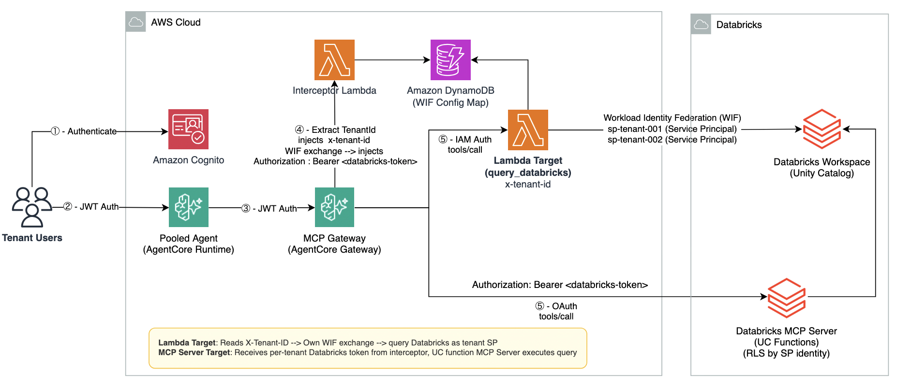

# Multi-Tenant AI Agent with Databricks Row-Level Security

A sample showing how multi-tenant AI agents can access Databricks through Amazon Bedrock AgentCore while keeping each tenant's data isolated. Isolation is enforced by Unity Catalog row filters. Cross-cloud authentication uses AWS IAM Workload Identity Federation (WIF), so no Databricks secrets are stored on the AWS side.

## Architecture



## How it works

A single AI agent serves multiple tenants. Each tenant gets a dedicated Databricks service principal. At request time, the Lambda or interceptor exchanges the caller's AWS IAM credentials for a short-lived Databricks token scoped to that tenant's SP. Unity Catalog row filters then restrict query results based on who is asking.

WIF configuration (per-tenant SP `client_id` mappings) lives in a DynamoDB table. The BigQuery sample in this repo uses a bundled `wif_config.json` template with a `{tenant_id}` placeholder that resolves at runtime. That approach works for GCP because SA emails follow a predictable naming pattern (`sa-{tenant_id}@project.iam.gserviceaccount.com`). Databricks SP client_ids are UUIDs assigned at creation time and cannot be derived from a naming pattern, so each one needs an explicit lookup. DynamoDB handles this with single-digit-millisecond reads and supports adding new tenants without redeploying any Lambda code.

Two integration paths are included:

| Target type | How it works | Best for |
|-------------|-------------|----------|
| Lambda target | Custom Lambda performs WIF exchange internally | Full control, custom SQL, multi-step workflows |
| MCP Server target | Interceptor performs WIF and injects token for Databricks UC Functions MCP Server | No custom code in the query path |

Both use the same isolation mechanism: per-tenant service principals + Unity Catalog row filters.

## WIF token exchange flow

```
AWS IAM credentials
  → sts:GetWebIdentityToken (signed OIDC JWT, 300s lifetime)
  → POST Databricks /oidc/v1/token (RFC 8693 token exchange with per-tenant client_id)
  → OAuth access token as tenant's Service Principal
```

No secrets are stored. The Lambda's IAM role is the credential.

## Row filter

```sql
CREATE OR REPLACE FUNCTION saas_workshop.saas_pilot.tenant_filter(row_tenant_id STRING)
RETURNS BOOLEAN
RETURN EXISTS (
  SELECT 1 FROM saas_workshop.saas_pilot.tenant_user_map
  WHERE user_email = current_user() AND tenant_id = row_tenant_id
);
```

Once applied, each service principal only sees rows where `tenant_user_map` maps its identity to the corresponding `tenant_id`. Any unmapped identity sees zero rows.

## Prerequisites

- AWS account with permissions to create Lambda, IAM, DynamoDB, Cognito, and AgentCore resources
- Databricks workspace on AWS (Unity Catalog enabled, SQL Warehouse running)
- AWS CDK v2 (`npm install -g aws-cdk`)
- Python 3.12+
- Container runtime: [Finch](https://github.com/runfinch/finch) or Docker (CDK builds the agent container image)
- Databricks CLI (for federation policy creation)
- Node.js 18+

### Databricks environment variables

These are required throughout the setup and testing scripts:

| Variable | Where to find it | Example |
|----------|-----------------|---------|
| `DATABRICKS_HOST` | Browser address bar when logged into your workspace (must include `https://`) | `https://dbc-xxxxx.cloud.databricks.com` |
| `DATABRICKS_TOKEN` | Profile icon, Settings, Developer, Access tokens, Generate new token | `dapi...` |
| `DATABRICKS_WAREHOUSE_ID` | SQL Warehouses, select your warehouse, Connection details, HTTP Path (last segment after `/sql/1.0/warehouses/`) | `68e37cd41b76b8f0` |
| `DATABRICKS_ACCOUNT_ID` | [accounts.cloud.databricks.com](https://accounts.cloud.databricks.com), top-right profile icon, Account ID | `adea35ca-...` |
| `DATABRICKS_ACCOUNT_TOKEN` | Account-level OAuth token (see below) | `eyJraWQi...` |

### Set variables before running any script

```bash
export DATABRICKS_HOST=https://dbc-xxxxx.cloud.databricks.com
export DATABRICKS_WAREHOUSE_ID=<warehouse-id>
export DATABRICKS_ACCOUNT_ID=<account-id>
```

### Generating the account token

The Databricks Account API requires an OAuth token. Workspace PATs do not work. Generate one with the Databricks CLI:

```bash
# Install (macOS)
brew install databricks/tap/databricks

# Login (opens browser for OAuth)
databricks auth login --host https://accounts.cloud.databricks.com --account-id $DATABRICKS_ACCOUNT_ID

# Print the token
databricks auth token --host https://accounts.cloud.databricks.com --account-id $DATABRICKS_ACCOUNT_ID
```

Copy the `access_token` value from the JSON output:

```bash
export DATABRICKS_ACCOUNT_TOKEN=eyJraWQi...
```

This token expires in 1 hour. Re-run `databricks auth token ...` if it expires mid-setup.

### Verify connectivity

```bash
curl -s -X POST "${DATABRICKS_HOST}/api/2.0/sql/statements/" \
  -H "Authorization: Bearer ${DATABRICKS_TOKEN}" \
  -H "Content-Type: application/json" \
  -d "{\"warehouse_id\": \"${DATABRICKS_WAREHOUSE_ID}\", \"statement\": \"SELECT 1 AS test\", \"wait_timeout\": \"30s\"}" \
  | python3 -c "import sys,json; r=json.load(sys.stdin); print('✓ Connected' if r.get('status',{}).get('state')=='SUCCEEDED' else f'✗ {r}')"
```

If your SQL Warehouse is stopped, start it from the Databricks UI (SQL Warehouses, select, Start) before running scripts.

## Deploy

### Step 1: Build Lambda layers and deploy AWS resources (CDK)

```bash
# Build Lambda layers
bash scripts/build_layers.sh

# Deploy CDK stack
cd cdk
python3 -m venv .venv && source .venv/bin/activate
pip install -r requirements.txt

# If using Finch instead of Docker:
export CDK_DOCKER=finch
```

Edit `cdk/cdk.context.json` with your Databricks workspace values:

```json
{
  "databricks_host": "https://dbc-xxxxx.cloud.databricks.com",
  "databricks_warehouse_id": "YOUR_WAREHOUSE_ID"
}
```

Then deploy:

```bash
cdk deploy --all
```

This creates:
- Cognito User Pool with test users (tenant-001, tenant-002)
- AgentCore Gateway with Cognito JWT authorizer
- DynamoDB table (`multi-tenant-databricks-wif-config`)
- Interceptor Lambda (header injection + WIF exchange)
- Databricks Query Lambda + IAM role
- Gateway targets (Lambda + MCP Server with DYNAMIC listing)
- AgentCore Runtime with Strands Agent container (ARM64)

---

### Step 2: Set up Databricks

Creates shared tables, per-tenant service principals, and row filters.

```bash
cd ../scripts
bash 01_setup_databricks.sh
```

What this creates:
- Catalog `saas_workshop`, schema `saas_pilot`
- Tables: `orders` (5 rows), `customer_data` (3 rows)
- Service principals: `sp-tenant-001`, `sp-tenant-002`
- `tenant_user_map` mapping table (SP applicationId to tenant_id)
- `tenant_filter` row filter function applied to both tables
- `get_orders` UC function for the MCP Server target

---

### Step 3: Configure Workload Identity Federation

Establishes trust between AWS IAM and Databricks. No secrets stored.

```bash
export DATABRICKS_ACCOUNT_TOKEN=<account-level-token>
bash 02_setup_wif.sh
```

What this does:
- Verifies AWS IAM Outbound Identity Federation is enabled
- Grants `sts:GetWebIdentityToken` to the Lambda and Interceptor roles
- Creates federation policies on each SP (trusting the Lambda + Interceptor IAM roles)
- Populates DynamoDB with per-tenant `client_id` mappings

---

### Step 4: Test Lambda target

```bash
bash 03_test_lambda_target.sh
```

Sends the same SQL as two different tenants and verifies different data comes back:

```
tenant-001: 3 rows (expected: 3)
tenant-002: 2 rows (expected: 2)
✅ PASS
```

---

### Step 5: Test MCP Server target

```bash
bash 04_test_mcp_target.sh
```

Calls the Databricks UC Functions MCP Server through the gateway. The interceptor handles WIF. No custom code in the query path.

```
tenant-001: 3 rows (expected: 3)
tenant-002: 2 rows (expected: 2)
✅ PASS
```

---

### Step 6: Test agent with natural language

```bash
bash 05_test_agent.sh
```

```
Tenant-001 prompt: How many orders do I have?
Agent: You have 3 orders.

Tenant-002 prompt: How many orders do I have?
Agent: You have 2 orders.
```

The agent code is tenant-unaware. It writes the same SQL for everyone. Isolation happens below, in the row filter.

## Tenant onboarding

Adding a new tenant requires one script and no AWS redeployment:

```bash
bash scripts/06_onboard_tenant.sh tenant-003
```

This creates the Databricks SP, adds federation policies, inserts the `client_id` into DynamoDB, and adds the SP to `tenant_user_map`. The Lambda picks up the new tenant on the next request.

<details>
<summary>What the script does</summary>

```bash
TENANT=tenant-003

# 1. Create Databricks service principal
SP_APP_ID=$(databricks service-principals create --display-name "sp-${TENANT}" --query applicationId --output text)

# 2. Add federation policy (trust Lambda's IAM role)
databricks account federation-policies create --service-principal-id $SP_ID --json '{...}'

# 3. Insert into DynamoDB
aws dynamodb put-item --table-name multi-tenant-databricks-wif-config --item '{
  "tenant_id": {"S": "'"$TENANT"'"},
  "client_id": {"S": "'"$SP_APP_ID"'"},
  "sp_name": {"S": "sp-'"$TENANT"'"}
}'

# 4. Add to tenant_user_map in Databricks
curl -X POST "${DATABRICKS_HOST}/api/2.0/sql/statements/" \
  -d '{"statement": "INSERT INTO saas_workshop.saas_pilot.tenant_user_map VALUES ('"'$SP_APP_ID'"', '"'$TENANT'"')"}'

# Done. No redeployment.
```

</details>

## Scaling

| Aspect | Limit | Notes |
|--------|-------|-------|
| Tenants | Unlimited (DynamoDB-backed) | No per-tenant AWS config changes |
| Databricks SPs | 10,000 per account (raisable) | Shard across workspaces beyond that |
| Federation policies | 20 per SP | 2 per SP in this pattern |
| DynamoDB reads | Single-digit ms | On-demand capacity, auto-scales |
| WIF exchange latency | ~500ms first call, cached ~250s | Sub-2ms on cache hit |

## Security model

| Layer | Mechanism | Failure mode |
|-------|-----------|-------------|
| Authentication | Cognito JWT (Gateway validates) | Invalid token: 401 |
| Tenant resolution | Interceptor decodes JWT claim | Missing claim: 401 |
| WIF config lookup | DynamoDB (client_id per tenant) | Missing item: 403 |
| Cross-cloud auth | WIF (no stored secrets) | IAM role compromise: scope limited to trusted SPs |
| Data isolation | Unity Catalog row filter (deny-by-default) | Wrong SP: still only sees that SP's mapped rows |
| Agent runtime auth | AgentCore JWT authorizer | Invalid caller: rejected before reaching agent |

## Cleanup

```bash
# AWS
cd cdk && source .venv/bin/activate
cdk destroy --all

# Databricks
cd ../scripts && bash 07_cleanup.sh
```

## References

### Amazon Bedrock AgentCore

- [AgentCore Developer Guide](https://docs.aws.amazon.com/bedrock-agentcore/latest/devguide/what-is.html)
- [AgentCore Gateway](https://docs.aws.amazon.com/bedrock-agentcore/latest/devguide/gateway.html)
- [AgentCore Runtime](https://docs.aws.amazon.com/bedrock-agentcore/latest/devguide/runtime.html)
- [Gateway Interceptors](https://docs.aws.amazon.com/bedrock-agentcore/latest/devguide/gateway-interceptors.html)
- [Gateway Header Propagation](https://docs.aws.amazon.com/bedrock-agentcore/latest/devguide/gateway-headers.html)
- [AWS IAM Outbound Identity Federation](https://docs.aws.amazon.com/IAM/latest/UserGuide/id_credentials_oidc_outbound.html)

### Databricks

- [AWS IAM Workload Identity Federation](https://docs.databricks.com/aws/en/dev-tools/auth/provider-aws-iam)
- [Configure a Federation Policy](https://docs.databricks.com/aws/en/dev-tools/auth/oauth-federation-policy)
- [Unity Catalog Row Filters](https://docs.databricks.com/aws/en/data-governance/unity-catalog/row-and-column-filters)
- [Databricks Managed MCP Servers](https://docs.databricks.com/aws/en/generative-ai/mcp/managed-mcp)
- [Databricks Service Principals](https://docs.databricks.com/en/dev-tools/service-principals.html)

## License

MIT-0
