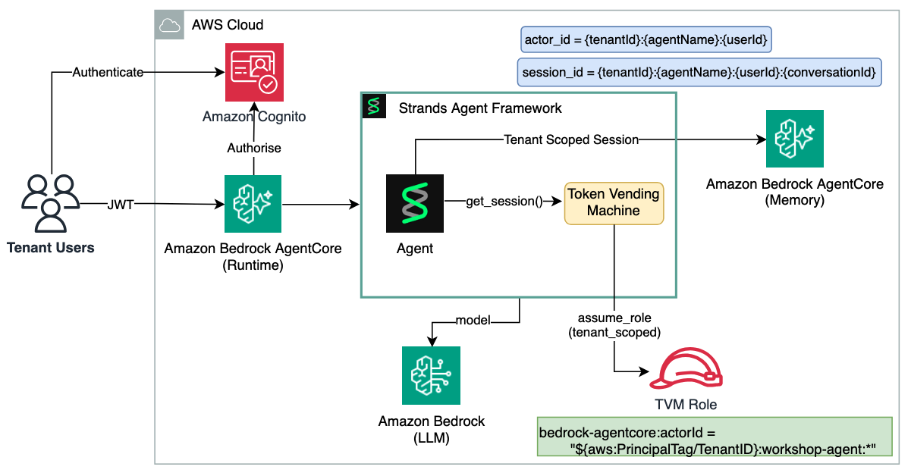

# Multi-tenant AgentCore Memory for Strands Agents

A tenant-isolated [Strands](https://strandsagents.com/) `SessionManager` that gives any Strands Agent persistent memory backed by [Amazon Bedrock AgentCore Memory](https://docs.aws.amazon.com/bedrock-agentcore/latest/devguide/memory.html). Multiple tenants share a single AgentCore Memory resource, but every memory operation is scoped to a single tenant at two independent layers - the application layer (identifier construction) and the AWS IAM control plane (ABAC on a [Token Vending Machine](https://docs.aws.amazon.com/prescriptive-guidance/latest/patterns/implement-saas-tenant-isolation-for-amazon-s3-by-using-an-aws-lambda-token-vending-machine.html) role).

---

## Motivation

Agent memory is one of the hardest multi-tenant surfaces to isolate because it is *implicit*. The agent never explicitly requests "load tenant-001's memories" - the framework loads them automatically on every turn, before the LLM runs. If isolation is left to application logic, a single bug silently leaks one tenant's conversations and facts into another tenant's context window.

This sample bakes isolation into the framework configuration and the IAM role instead:

1. **Two-layer isolation.** At the application layer, `actor_id` and `session_id` embed `tenantId` so identifiers never collide across tenants. At the IAM layer, STS AssumeRole with a `TenantID` session tag enforces isolation at the control plane - even a buggy agent that constructs the wrong `actor_id` is denied by AWS.

2. **One shared memory resource.** Unlike an index-per-tenant design, all tenants use a single AgentCore Memory resource. Isolation comes from the `actor_id`/`namespace` IAM conditions, not from separate resources, so onboarding a tenant requires no new infrastructure.

3. **Drop-in session manager.** The isolation lives in a `SessionManager` subclass that registers a `BeforeInvocationEvent` hook. Wiring it to an agent is a single constructor argument - no plugin, no changes to the agent's tools or prompt.

---

## Architecture

Multiple tenants share one Strands agent, one AgentCore Memory resource, and one TVM IAM role - there is no per-tenant infrastructure to provision or manage. The agent runs as a singleton on AgentCore Runtime, so it must stay safe to invoke concurrently on behalf of any tenant, request by request.

A request arrives as an HTTP call to AgentCore Runtime carrying a Cognito-issued JWT. AgentCore Runtime validates the JWT's signature via its built-in authorizer and forwards it to the container. The agent code decodes the JWT's claims (never trusting anything from the request body) to get `tenant_id` and the user's `sub`, and passes them into the agent call as `invocation_state`.

Before the agent's model runs, the `MultiTenantAgentCoreMemorySessionManager` hook fires and does two things: it calls the TVM to exchange the tenant id for short-lived, tenant-scoped AWS credentials (STS AssumeRole with a `TenantID` session tag), and it rebuilds the `actor_id`/`session_id`/namespace for this request so they're prefixed with that tenant's id. Only after both are set does the session manager read short-term conversation history and long-term preferences from AgentCore Memory and inject them into the prompt. On the way out, the new turn is written back the same way - under the same tenant-scoped identifiers, using the same tenant-scoped credentials.



Isolation is enforced at two independent layers:

- **Application layer** - `actor_id` is `{tenantId}:{agentName}:{userId}` and `session_id` is `{tenantId}-{agentName}-{userId}-{conversationId}`. Every memory event is stored under a tenant-scoped identifier.
- **IAM layer** - the TVM role's condition `bedrock-agentcore:actorId = "${aws:PrincipalTag/TenantID}:*"` enforces that a session tagged `TenantID=tenant-001` can only access actors starting with `tenant-001:`. A parallel `bedrock-agentcore:namespacePath` condition scopes long-term (semantic) memory retrieval.

### AgentCore Memory identifiers

| Identifier | Format | Purpose | IAM condition |
|-----------|--------|---------|---------------|
| `actorId` | `{tenantId}:{agentName}:{userId}` | Owns all memory events (conversations, facts) | `bedrock-agentcore:actorId` |
| `sessionId` | `{tenantId}-{agentName}-{userId}-{conversationId}` | Scopes short-term working memory to one conversation | - |
| `namespace` | `/{actorId}/preferences`, `/{actorId}/facts` | Scopes long-term retrieval (preferences + semantic facts) | `bedrock-agentcore:namespacePath` |

> **`namespace` vs `namespacePath`.** Long-term retrieval must condition on `bedrock-agentcore:namespacePath` (prefix retrieval), **not** `bedrock-agentcore:namespace`. The SDK's `RetrieveMemoryRecords` call issues a `namespacePath` (prefix) request; conditioning on `namespace` never matches, IAM returns `AccessDeniedException`, the SDK swallows it, and the agent silently behaves as if it has no long-term memory. Short-term memory (`ListEvents`/`CreateEvent`, conditioned on `actorId`) is unaffected.

### How memory is implemented

All tenants share a single AgentCore Memory resource. Isolation and persistence are wired through a custom Strands `SessionManager` (`MultiTenantAgentCoreMemorySessionManager`) rather than in the agent's own logic:

1. **Per-request tenant binding.** The session manager registers a `BeforeInvocationEvent` hook that calls `_prepare()` on each invocation. It reads `tenant_context`, `user_id`, and `conversation_id` from `invocation_state`, rebuilds the tenant-scoped `actor_id`/`session_id`, sets `retrieval_config`, and swaps the memory client's boto3 clients to TVM credentials (STS AssumeRole + `TenantID` session tag) for that tenant - credentials are swapped **before** any read, so every memory call runs under IAM ABAC, not ambient container credentials.

2. **Short-term memory (conversation history).** Every turn is written to AgentCore Memory as an event under the current `sessionId` via `CreateEvent`. `_prepare` detects when the `session_id` changes and, on change, **rehydrates** `agent.messages` from AgentCore Memory via `list_messages` (`ListEvents`). This matters because on AgentCore Runtime the `Agent` is a module-level singleton whose in-process `agent.messages` is only a *warm-microVM cache*: a "known" `runtimeSessionId` can land on a **fresh microVM** after idle (15 min) or max-lifetime (8 hr) termination, with an empty `agent.messages`. Reading STM back per session change is what makes short-term recall survive a microVM boundary. (Assigning `agent.messages` directly does not re-emit `MessageAddedEvent`, so restored history is not re-persisted.)

3. **Long-term memory (durable preferences + facts).** The Memory resource is created with **two** strategies: a `USER_PREFERENCE` strategy at `/{actorId}/preferences` and a `SEMANTIC` strategy at `/{actorId}/facts`. AgentCore asynchronously extracts durable preferences and facts from conversation events (using a service-managed Bedrock model via the memory execution role) and stores them under those namespaces. The session manager's `retrieval_config` points at the same two namespaces, so before each turn the framework retrieves any matching records and injects them into the prompt as a `<user_context>` block - enabling recall across different conversations, not just within one session.

4. **Tenant isolation at the control plane.** Because `actor_id` and the resolved namespaces (`/tenant-001:assistant:user-456/preferences`, `/.../facts`) always begin with the tenant id, the TVM role's `actorId` and `namespacePath` ABAC conditions physically deny any cross-tenant read or write at the AWS control plane - regardless of what the application code does.

**STM vs LTM - two distinct read paths.** Short-term memory is the ordered transcript for one `sessionId`, restored into `agent.messages` once per session change. Long-term memory is facts/preferences retrieved by semantic search on every turn via `retrieval_config`. STM recall is scoped to one conversation; LTM recall spans conversations for the same actor.

---

## Usage

Wire the session manager to any Strands Agent with a single constructor argument. On every turn, the `BeforeInvocationEvent` hook reads `tenant_context`, `user_id`, and `conversation_id` from `invocation_state`, rebuilds the tenant-scoped `actor_id`/`session_id`, and swaps the boto3 clients to use TVM credentials for that tenant.

```python
import os
from strands import Agent
from strands.models import BedrockModel
from agentcore_memory import MultiTenantAgentCoreMemorySessionManager

session_manager = MultiTenantAgentCoreMemorySessionManager(
    memory_id    = os.environ["AGENTCORE_MEMORY_ID"],
    tvm_role_arn = os.environ["AGENTCORE_TVM_ROLE_ARN"],
)

agent = Agent(
    model           = BedrockModel(model_id="amazon.nova-pro-v1:0"),
    system_prompt   = "You are a helpful assistant.",
    session_manager = session_manager,
)
```

Store a fact for tenant-001:

```python
agent("Remember that my favourite colour is blue.", invocation_state={
    "tenant_context":  {"tenantId": "tenant-001"},
    "user_id":         "user-456",
    "conversation_id": "conv-001",
})
```

Recall it in the same conversation:

```python
agent("What is my favourite colour?", invocation_state={
    "tenant_context":  {"tenantId": "tenant-001"},
    "user_id":         "user-456",
    "conversation_id": "conv-001",
})
```

`MultiTenantAgentCoreMemorySessionManager` requires `tvm_role_arn` (passed directly or via `AGENTCORE_TVM_ROLE_ARN`). Omitting it raises `ValueError` to prevent silently running with ambient credentials and bypassing IAM ABAC isolation.

To run the example server locally instead of deploying, start it after setting `AGENTCORE_MEMORY_ID`, `AGENTCORE_TVM_ROLE_ARN`, and `AWS_REGION`. The server listens on `http://127.0.0.1:8080`:

```bash
python3 examples/multi_tenant_agent.py
```

### `invocation_state` keys

| Key | Type | Required | Description |
|-----|------|----------|-------------|
| `tenant_context` | `dict` | Yes | Must contain `tenantId`. Activates the STS session tag and identifier scoping |
| `user_id` | `str` | Yes | User identifier - embedded into `actor_id` and `session_id` |
| `conversation_id` | `str` | Yes | Scopes short-term working memory to one conversation |

---

## Requirements

- Python 3.10+
- `strands-agents >= 1.56.0`
- `boto3 >= 1.34`
- `cachetools >= 5.3` (used by the TVM for credential caching)
- `bedrock-agentcore[strands-agents] >= 1.23.1` (1.23.1 fixes a `strands` import incompatibility present in 1.23.0)
- `bedrock-agentcore-starter-toolkit >= 0.1.0` (for AgentCore Runtime deployment - install via `pip install -e ".[agentcore]"`)
- AWS account with Bedrock AgentCore Memory access and a Bedrock text model enabled in your region (default `amazon.nova-pro-v1:0`)
- AWS CLI v2 configured with credentials that can access IAM, Bedrock, Bedrock AgentCore, Cognito, and STS

---

## Run the sample

The example is designed for deployment on [Amazon Bedrock AgentCore Runtime](https://docs.aws.amazon.com/bedrock-agentcore/latest/devguide/what-is-bedrock-agentcore.html) - a serverless runtime that handles HTTP serving, JWT authentication, and session isolation (one request per microVM). It is a self-contained HTTP server built on `BedrockAgentCoreApp`.

Run the steps below in order.

### 1. Create and activate a virtual environment

```bash
python3 -m venv .venv
source .venv/bin/activate
```

### 2. Install the library and toolkit

Install the core library:

```bash
pip install -e .
```

Install the AgentCore Runtime starter toolkit (needed to deploy the example):

```bash
pip install -e ".[agentcore]"
```

### 3. Run the unit tests

Unit tests require no AWS credentials - external SDKs and boto3 are mocked.

Install the dev extras:

```bash
pip install -e ".[dev]"
```

Run the tests:

```bash
python3 -m pytest tests/unit/ -q
```

### 4. Create the AgentCore Memory resource

```bash
export AWS_REGION=us-east-1
bash scripts/setup_memory.sh
```

The script prints `export` lines for `AGENTCORE_MEMORY_ID` and `AGENTCORE_MEMORY_ARN`. Copy them into your shell:

```bash
export AGENTCORE_MEMORY_ID=<printed-id>
export AGENTCORE_MEMORY_ARN=<printed-arn>
```

### 5. Create the TVM IAM role

```bash
bash scripts/setup_tvm_role.sh $AGENTCORE_MEMORY_ARN
```

The script prints an `export` line for `AGENTCORE_TVM_ROLE_ARN`. Copy it into your shell:

```bash
export AGENTCORE_TVM_ROLE_ARN=<printed-arn>
```

### 6. Create the Cognito user pool and test users

```bash
bash scripts/setup_cognito.sh
```

Each test user carries a `custom:tenant_id` claim (`tenant-001`, `tenant-002`) that the agent reads from the JWT to build tenant-scoped identifiers. The script prints `COGNITO_USER_POOL_ID`, `COGNITO_CLIENT_ID`, the test usernames, and the password. Copy the values into your shell:

```bash
export COGNITO_USER_POOL_ID=<printed>
export COGNITO_CLIENT_ID=<printed>
export COGNITO_USER_PASSWORD=<printed>
```

### 7. Prove isolation at the IAM control plane

The `prove_isolation.py` script bypasses the agent entirely and calls the AgentCore Memory API directly with TVM-scoped credentials, proving that tenant-002 is *physically denied* from accessing tenant-001's memory. This is not application-level filtering - it is IAM enforcement. Even if the agent code had a bug and tried to read another tenant's memory, the AWS control plane would deny it.

```bash
python3 examples/prove_isolation.py
```

Expected output:

```
-- Step 1: Tenant-001 accesses OWN memory (should succeed) --
  ✓ SUCCESS - tenant-001 listed events (count: ...)

-- Step 2: Tenant-002 accesses TENANT-001's memory (should DENY) --
  ✓ ISOLATION CONFIRMED - IAM denied the request
```

### 8. Deploy to AgentCore Runtime

Ensure the prerequisite variables from the earlier steps are exported: `AGENTCORE_MEMORY_ID`, `AGENTCORE_MEMORY_ARN`, `AGENTCORE_TVM_ROLE_ARN`, `COGNITO_USER_POOL_ID`, `COGNITO_CLIENT_ID`.

Run the deploy:

```bash
bash scripts/setup_agentcore.sh
```

The script packages `examples/` + `src/` into a deployment artifact, configures a Cognito JWT authorizer, and attaches the Bedrock, TVM, and AgentCore Memory permissions to the execution role. It prints an `export AGENT_ARN=...` line. Copy it into your shell:

```bash
export AGENT_ARN=<printed-arn>
```

Build the invocation and stop endpoints from the URL-encoded ARN. The **stop** endpoint (`stopruntimesession`) tears down a session's microVM - we use it below to prove short-term recall comes from AgentCore Memory, not warm container state:

```bash
ARN_ENC=$(python3 -c "import urllib.parse,os;print(urllib.parse.quote(os.environ['AGENT_ARN'],safe=''))")
export LAB_AGENT_ENDPOINT="https://bedrock-agentcore.${AWS_REGION}.amazonaws.com/runtimes/${ARN_ENC}/invocations?qualifier=DEFAULT"
export LAB_STOP_ENDPOINT="https://bedrock-agentcore.${AWS_REGION}.amazonaws.com/runtimes/${ARN_ENC}/stopruntimesession?qualifier=DEFAULT"
```

Obtain a JWT for `tenant-001` (used for all `tenant-001` calls below):

```bash
TOKEN_TENANT_1=$(aws cognito-idp initiate-auth \
  --auth-flow USER_PASSWORD_AUTH \
  --client-id $COGNITO_CLIENT_ID \
  --auth-parameters USERNAME=tenant001@example.com,PASSWORD=$COGNITO_USER_PASSWORD \
  --query 'AuthenticationResult.IdToken' --output text)
```

### 9. Store a fact

Store a fact in conversation `conv-001`. The agent acknowledges it and returns `"tenant_id": "tenant-001"`:

```bash
curl -s -X POST "$LAB_AGENT_ENDPOINT" \
  -H "Authorization: Bearer $TOKEN_TENANT_1" \
  -H "Content-Type: application/json" \
  -H "X-Amzn-Bedrock-AgentCore-Runtime-Session-Id: tenant-001-agentcore-memory-session-01" \
  -d '{"message": "Remember that my favourite colour is blue", "conversation_id": "conv-001"}'
```

### 10. Prove short-term memory (recall after the microVM is terminated)

Within a live session, the agent could recall "blue" from warm in-process `agent.messages` - that does not prove memory was persisted. To make it unambiguous, **terminate the running session's microVM** and then invoke again with the **same** `runtimeSessionId` and **same** conversation. On the next invoke, AgentCore provisions a fresh microVM with an empty `agent.messages`, so a correct recall can only come from `list_messages` (`ListEvents`) in AgentCore Memory via the session rehydrate in `_prepare`.

Stop the session (tears down its microVM). Because the agent uses a custom JWT authorizer, the stop call must use the **same Bearer token** as invoke - an `aws` CLI SigV4 call would be rejected with an authorization-method mismatch:

```bash
curl -s -X POST "$LAB_STOP_ENDPOINT" \
  -H "Authorization: Bearer $TOKEN_TENANT_1" \
  -H "Content-Type: application/json" \
  -H "X-Amzn-Bedrock-AgentCore-Runtime-Session-Id: tenant-001-agentcore-memory-session-01" \
  -d '{}'

# Allow teardown to complete. Invoking during provision/teardown can return a
# retryable HTTP 409 (RetryableConflictException); the wait avoids it.
sleep 10
```

Now recall using the **same** session id and the **same** conversation:

```bash
curl -s -X POST "$LAB_AGENT_ENDPOINT" \
  -H "Authorization: Bearer $TOKEN_TENANT_1" \
  -H "Content-Type: application/json" \
  -H "X-Amzn-Bedrock-AgentCore-Runtime-Session-Id: tenant-001-agentcore-memory-session-01" \
  -d '{"message": "What is my favourite colour?", "conversation_id": "conv-001"}'
```

> **Expected:** the agent recalls "blue". Same session id, same conversation - but because the microVM was terminated, `agent.messages` started empty and the answer came from AgentCore Memory (`ListEvents`), not warm container state.
>
> If you get `RetryableConflictException` or HTTP 409, the microVM was still tearing down or provisioning - wait a few more seconds and re-run the recall.

### 11. Prove long-term memory (recall across conversations)

AgentCore extracts long-term preferences/facts asynchronously into the strategy namespaces. Wait for extraction, then ask in a **new** conversation (`conv-002`). A different `conversation_id` means a different `session_id` and a separate STM stream, so this recall can only come from LTM semantic retrieval (`retrieval_config` → `/{actorId}/preferences`, `/{actorId}/facts`), injected as a `<user_context>` block:

```bash
sleep 60  # allow async strategy extraction to complete

curl -s -X POST "$LAB_AGENT_ENDPOINT" \
  -H "Authorization: Bearer $TOKEN_TENANT_1" \
  -H "Content-Type: application/json" \
  -H "X-Amzn-Bedrock-AgentCore-Runtime-Session-Id: tenant-001-agentcore-memory-session-03" \
  -d '{"message": "What is my favourite colour?", "conversation_id": "conv-002"}'
```

> **Expected:** the agent recalls "blue" in a conversation where it was never told. If extraction has not finished, retry after another `sleep 30` - extraction latency varies.

### 12. Verify tenant isolation

Obtain a JWT for `tenant-002` and ask the same question. Tenant-002's `actor_id` is `tenant-002:...`, which never matches tenant-001's actor or namespaces, so both the STM read and the LTM retrieval run under tenant-002's TVM credentials and return nothing:

```bash
TOKEN_TENANT_2=$(aws cognito-idp initiate-auth \
  --auth-flow USER_PASSWORD_AUTH \
  --client-id $COGNITO_CLIENT_ID \
  --auth-parameters USERNAME=tenant002@example.com,PASSWORD=$COGNITO_USER_PASSWORD \
  --query 'AuthenticationResult.IdToken' --output text)

curl -s -X POST "$LAB_AGENT_ENDPOINT" \
  -H "Authorization: Bearer $TOKEN_TENANT_2" \
  -H "Content-Type: application/json" \
  -H "X-Amzn-Bedrock-AgentCore-Runtime-Session-Id: tenant-002-agentcore-memory-session-01" \
  -d '{"message": "What is my favourite colour?", "conversation_id": "conv-001"}'
```

> **Expected:** tenant-002 has no memory of any favourite colour - same agent, completely isolated memory per tenant. The control-plane denial is proven directly in step 7 (`prove_isolation.py`).

> **`runtimeSessionId` length:** the `X-Amzn-Bedrock-AgentCore-Runtime-Session-Id` header must be 33-64 characters.

> **JWT token type:** use the Cognito **IdToken** (not AccessToken). The IdToken contains `custom:tenant_id` and its `aud` claim matches the `allowedAudience` configured in the JWT authorizer.

---

## Clean up

Tear down every AWS resource created by the setup scripts, plus local toolkit artifacts:

```bash
bash scripts/cleanup.sh
```

---

## Performance and optimization

Memory adds work to the request path, and that cost is not uniform across turns. The first turn of a conversation is the most expensive: `_prepare` runs the memory-load work before the model - assuming the tenant's credentials, building clients, rehydrating short-term history, and retrieving long-term memory. Later turns in the same conversation are cheaper because `_prepare` detects the session is unchanged and skips the rehydrate.

Opportunities to reduce this, roughly in order of value-to-risk:

- **Cache the per-tenant scoped clients.** The boto3 clients are rebuilt on every invocation; cache them per tenant and rebuild only when the credentials rotate.
- **Skip the rebind on warm turns.** On a same-session turn nothing has changed, so guard the client swap and identifier rebind behind an actual session or credential change.
- **Tune long-term retrieval.** Retrieval runs against both namespaces on every turn - lower the result count, run the namespaces concurrently, or retrieve only on the first turn if the use case tolerates it.
- **Bound the short-term rehydrate.** Cap how much transcript is read back so a very long conversation does not rehydrate unbounded.
- **Trim cold-start.** Slimming the deployed dependencies reduces fresh-microVM startup, though this only affects idle or terminated sessions.

The first two are local, behavior-preserving changes with the best value-to-risk. Tuning retrieval changes recall behavior, so weigh the tradeoff for your workload before applying it.

---

## Further reading

- [Amazon Bedrock AgentCore Memory](https://docs.aws.amazon.com/bedrock-agentcore/latest/devguide/memory.html)
- [Strands Agents Session Management](https://strandsagents.com/docs/user-guide/concepts/agents/session-management/)
- [Token Vending Machine pattern](https://docs.aws.amazon.com/prescriptive-guidance/latest/patterns/implement-saas-tenant-isolation-for-amazon-s3-by-using-an-aws-lambda-token-vending-machine.html)
- [AWS STS session tags](https://docs.aws.amazon.com/IAM/latest/UserGuide/id_session-tags.html)
