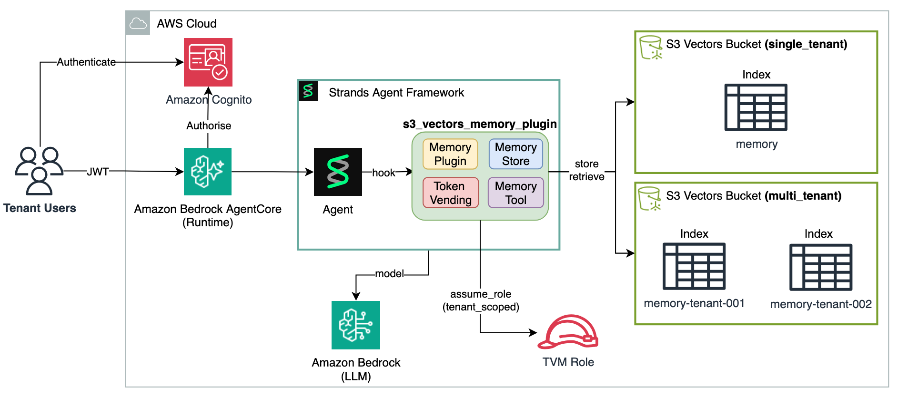

# S3 Vector Memory Plugin

The S3 Vector Memory Plugin is a [Strands Plugin](https://strandsagents.com/docs/user-guide/concepts/plugins/) that gives any Strands Agent long-term semantic memory backed by [Amazon S3 Vectors](https://docs.aws.amazon.com/AmazonS3/latest/userguide/s3-vectors.html). At the end of a conversation, the plugin summarizes the full exchange using the agent's own model and stores the summary as a searchable vector. On subsequent conversations, relevant summaries are retrieved and injected into the system prompt before the LLM responds.

Available in two modes:

- **Single-tenant** — one shared index, no extra IAM setup
- **Multi-tenant** — one index per tenant, IAM credentials scoped per tenant via the [Token Vending Machine (TVM)](https://docs.aws.amazon.com/prescriptive-guidance/latest/patterns/implement-saas-tenant-isolation-for-amazon-s3-by-using-an-aws-lambda-token-vending-machine.html) pattern



## Requirements

- Python 3.10+
- `strands-agents >= 1.0.0`
- `boto3 >= 1.35`
- `cachetools >= 5.0` (multi-tenant only)
- AWS account with S3 Vectors access and Bedrock Nova Embeddings enabled in your region

## Install

```bash
python3 -m venv .venv
source .venv/bin/activate
pip install -e .
```

## AWS Setup

### 1. Create the S3 Vectors bucket

```bash
export AWS_REGION=us-east-1
export S3_VECTOR_BUCKET_NAME=my-vector-memory

aws s3vectors create-vector-bucket \
  --vector-bucket-name $S3_VECTOR_BUCKET_NAME \
  --region $AWS_REGION
```

### 2. Create the TVM IAM role (multi-tenant only)

```bash
bash scripts/setup_tvm_role.sh $S3_VECTOR_BUCKET_NAME
# Prints: export S3_VECTOR_TVM_ROLE_ARN=arn:aws:iam::<account-id>:role/...
export S3_VECTOR_TVM_ROLE_ARN=<printed-arn>
```

### 3. Create indexes

**Single-tenant** — one shared index named `memory`:

```bash
aws s3vectors create-index \
  --vector-bucket-name $S3_VECTOR_BUCKET_NAME \
  --index-name memory \
  --data-type float32 \
  --dimension 1024 \
  --distance-metric cosine \
  --metadata-configuration '{"nonFilterableMetadataKeys":["content","stored_at","conversation_id","type"]}' \
  --region $AWS_REGION
```

**Multi-tenant** — one index per tenant (repeat at onboarding time):

```bash
for TENANT in tenant-001 tenant-002; do
  aws s3vectors create-index \
    --vector-bucket-name $S3_VECTOR_BUCKET_NAME \
    --index-name memory-${TENANT} \
    --data-type float32 \
    --dimension 1024 \
    --distance-metric cosine \
    --metadata-configuration '{"nonFilterableMetadataKeys":["content","stored_at","conversation_id","type"]}' \
    --region $AWS_REGION
done
```

`user_id` is left filterable so `query_vectors` can scope results to a single user within a tenant's index.

## Usage

The plugin integrates with a Strands Agent through five explicit steps. Each step has specific requirements described below.

### 1. `{memory_context}` placeholder

`BASE_PROMPT` **must** contain the `{memory_context}` placeholder. The plugin replaces it with retrieved conversation summaries on the first turn of each conversation, or with an empty string when no relevant memories are found.

```python
BASE_PROMPT = """You are a helpful assistant.

{memory_context}

Be concise and cite prior context when relevant."""
```

- The placeholder can appear anywhere in the prompt — place it where you want memories to appear relative to other instructions.
- If the placeholder is missing, the plugin logs a `WARNING` at construction time and memories are never injected. The agent still works, but without long-term memory.
- The plugin strips leading/trailing whitespace after substitution, so an empty `{memory_context}` does not leave a blank line in the prompt.

### 2. Store configuration

Choose the store class based on your tenancy model.

**Single-tenant** — one shared index, no per-tenant isolation:

```python
from strands_s3_vectors_memory import S3VectorMemory

store = S3VectorMemory(
    bucket_name     = os.environ["S3_VECTOR_BUCKET_NAME"],  # required
    region_name     = "us-east-1",                          # default: AWS_REGION env var
    embedding_model = "amazon.nova-2-multimodal-embeddings-v1:0",  # default
)
```

**Multi-tenant** — one index per tenant, TVM-scoped credentials:

```python
from strands_s3_vectors_memory import MultiTenantS3VectorMemory

store = MultiTenantS3VectorMemory(
    bucket_name     = os.environ["S3_VECTOR_BUCKET_NAME"],  # required
    tvm_role_arn    = os.environ["S3_VECTOR_TVM_ROLE_ARN"], # required — raises ValueError if absent
    region_name     = "us-east-1",                          # default: AWS_REGION env var
    embedding_model = "amazon.nova-2-multimodal-embeddings-v1:0",  # default
)
```

`MultiTenantS3VectorMemory` has no fallback — omitting `tvm_role_arn` always raises `ValueError` to prevent silent bypass of IAM ABAC isolation.

### 3. Plugin configuration

```python
from strands_s3_vectors_memory import S3VectorMemoryPlugin

plugin = S3VectorMemoryPlugin(
    store       = store,        # S3VectorMemory or MultiTenantS3VectorMemory
    base_prompt = BASE_PROMPT,  # must contain {memory_context}
)
```

The plugin is a singleton — create it once and reuse it across all requests. It maintains an internal `TTLCache` keyed by `conversation_id` (maxsize 10,000, TTL 2 hours).

### 4. Agent creation

Pass the plugin in the `plugins` list. Optionally add `plugin.memory_tool` to `tools` to enable mid-turn recall on demand. The agent is a singleton — created once, shared across all requests.

```python
from strands import Agent
from strands.models import BedrockModel

agent = Agent(
    model         = BedrockModel(),
    system_prompt = BASE_PROMPT,  # must match the base_prompt passed to the plugin
    tools         = [plugin.memory_tool],  # optional — enables mid-turn recall
    plugins       = [plugin],
)
```

- `system_prompt` should be set to `BASE_PROMPT` at construction. The plugin resets it on every call, so the initial value is overwritten immediately — but it must be set to avoid a `None` prompt on the very first call before the hook fires.
- `callback_handler=None` suppresses Strands' default streaming output to stdout. Omit it if you want streaming.
- `tools=[plugin.memory_tool]` is optional. Without it, the agent still gets automatic memory injection on the first turn of each conversation via `before_invocation`. The tool adds the ability for the LLM to retrieve memories on demand mid-turn.

### 5. Agent invocation — passing `invocation_state`

Call the agent with `invocation_state` on every turn. The plugin reads identity and lifecycle control from this dict.

**Single-tenant:**

```python
response = agent("My favourite framework is Strands Agents.", invocation_state={
    "user_id":         "user-001",   # required — scopes vector filter
    "conversation_id": "conv-001",   # required — scopes buffer and summary key
    "end_session":     False,        # optional, default False
})
```

**Multi-tenant:**

```python
response = agent("Our Q4 budget is $2M.", invocation_state={
    "tenant_context":  {             # required for MultiTenantS3VectorMemory
        "tenantId":   "tenant-001",  # required — determines index name + TVM scope
        "tenantName": "Acme Corp",   # optional
    },
    "user_id":         "user-456",
    "conversation_id": "conv-001",
    "end_session":     False,
})
```

**`invocation_state` key reference:**

| Key | Type | Required | Description |
|-----|------|----------|-------------|
| `user_id` | `str` | Yes | Scopes vector filter — memories are only retrieved for this user |
| `conversation_id` | `str` | Yes | Scopes the in-process buffer and the deterministic summary key |
| `end_session` | `bool` | No (default `False`) | If `True`, summarizes and stores the conversation after the response (non-blocking background thread) |
| `tenant_context` | `dict` | Multi-tenant only | Must contain `tenantId` — determines the index name and TVM credential scope |

**Session lifecycle:**

- Set `end_session=False` on all turns except the last.
- Set `end_session=True` on the final turn. The plugin offloads summarization to a background thread — the response returns immediately without waiting for the S3 write.
- Starting a new `conversation_id` is treated as a fresh conversation — memories from prior sessions are retrieved on the first turn.

### 6. `memory_tool` — mid-turn recall on demand

The `memory_tool` is a Strands `@tool` exposed by the plugin. When wired to the agent, the LLM can call it mid-conversation to retrieve specific memories it discovers it needs during reasoning.

**Contract:**

| | |
|---|---|
| **Trigger** | LLM decides mid-reasoning it needs a specific fact |
| **Identity** | `user_id` and `tenant_context` read automatically from plugin `ContextVar`s — set by `before_invocation` before the LLM runs |
| **LLM input** | `query` (natural language), `top_k` (optional, default 3) |
| **Returns** | Formatted string of relevant memories, or `"No relevant memories found."` |
| **Storage** | Never — retrieve-only. The LLM cannot write memories. |
| **Threshold** | Same `_SIMILARITY_THRESHOLD = 0.5` as automatic injection |

**Tool parameters:**

| Parameter | Type | Required | Description |
|---|---|---|---|
| `query` | `str` | Yes | Natural language description of what to search for |
| `top_k` | `int` | No (default 3) | Maximum number of memories to return |

**When to use it vs automatic injection:**

| Mechanism | When it fires | Best for |
|---|---|---|
| `before_invocation` auto-inject | First turn of every conversation | Broad contextual priming — surfaces the most relevant prior context for the current session |
| `memory_tool` | When the LLM calls it mid-turn | Specific targeted recall — a topic pivot, a temporally distant memory, or a fact the LLM needs mid-chain-of-thought |

**Real-world examples where `memory_tool` is needed:**

- Customer support: session starts about billing, user pivots mid-turn to ask about a refund from last month — different topic, different keywords, not in the initial injection
- Financial advisor: agent is walking through portfolio allocation, user asks "what risk tolerance did we agree on two years ago?" — temporally distant, semantically different from the current context
- Project assistant: agent is debugging a module, user asks "what was the architecture decision we made about the database layer?" — a design decision from months ago with no overlap with the current debugging context
- Multi-step reasoning: the LLM itself discovers mid-chain-of-thought that it needs a specific fact to complete its answer, without the user explicitly asking for it

**Example output when the tool is called:**

```
Relevant memories:
- [20250101_120000] User's Q4 budget is $2M and is confidential.
- [20250115_090000] User prefers conservative financial planning.
```

### Composing with a Short-Term Session Manager

The plugin is decoupled from any `SessionManager`. Attach both independently:

```python
agent = Agent(
    model           = BedrockModel(),
    system_prompt   = BASE_PROMPT,
    session_manager = session_manager,   # short-term: persists agent.messages
    plugins         = [plugin],          # long-term:  semantic memory via S3 Vectors
)
```

| Concern | Owner |
|---------|-------|
| Conversation history across HTTP requests | `SessionManager` (Valkey, DynamoDB, etc.) |
| Long-term semantic memory across conversations | `S3VectorMemoryPlugin` |

## Quick Start Examples

### Single-tenant

```python
import os
from strands import Agent
from strands.models import BedrockModel
from strands_s3_vectors_memory import S3VectorMemory, S3VectorMemoryPlugin

BASE_PROMPT = """You are a helpful assistant.

{memory_context}

Use prior context naturally in your responses."""

store  = S3VectorMemory(bucket_name=os.environ["S3_VECTOR_BUCKET_NAME"])
plugin = S3VectorMemoryPlugin(store=store, base_prompt=BASE_PROMPT)
agent  = Agent(
    model         = BedrockModel(),
    tools         = [plugin.memory_tool],  # optional: mid-turn recall on demand
    plugins       = [plugin],
    system_prompt = BASE_PROMPT,
)

# Turn 1 — agent responds; memory not yet stored
agent("My favourite framework is Strands Agents.", invocation_state={
    "user_id": "user-001", "conversation_id": "conv-001", "end_session": False,
})

# Turn 2 — end_session=True triggers background summarization and vector store
agent("Thanks, bye.", invocation_state={
    "user_id": "user-001", "conversation_id": "conv-001", "end_session": True,
})

# Next session — plugin retrieves the stored summary and injects it into the prompt
agent("What do you know about my preferences?", invocation_state={
    "user_id": "user-001", "conversation_id": "conv-002", "end_session": False,
})
```

### Multi-tenant

```python
import os
from strands import Agent
from strands.models import BedrockModel
from strands_s3_vectors_memory import MultiTenantS3VectorMemory, S3VectorMemoryPlugin

BASE_PROMPT = """You are a helpful assistant.

{memory_context}

Use prior context naturally in your responses."""

store  = MultiTenantS3VectorMemory(
    bucket_name  = os.environ["S3_VECTOR_BUCKET_NAME"],
    tvm_role_arn = os.environ["S3_VECTOR_TVM_ROLE_ARN"],
)
plugin = S3VectorMemoryPlugin(store=store, base_prompt=BASE_PROMPT)
agent  = Agent(
    model         = BedrockModel(),
    tools         = [plugin.memory_tool],  # optional: mid-turn recall on demand
    plugins       = [plugin],
    system_prompt = BASE_PROMPT,
)

tenant_context = {
    "tenantId":   "tenant-001",
    "tenantName": "Acme Corp",
}

# Mid-conversation turn
agent("Our Q4 budget is $2M.", invocation_state={
    "tenant_context":  tenant_context,
    "user_id":         "user-456",
    "conversation_id": "conv-001",
    "end_session":     False,
})

# Final turn — plugin summarizes and stores to S3 Vectors in a background thread
agent("Thanks, bye.", invocation_state={
    "tenant_context":  tenant_context,
    "user_id":         "user-456",
    "conversation_id": "conv-001",
    "end_session":     True,
})
```

## How It Works

The plugin registers two lifecycle hooks on the Strands agent:

```
agent(message, invocation_state={...})
        │
        ▼
before_invocation hook
  ├── bind tenant + user + conversation identity
  ├── restore agent.messages from in-process buffer (no SessionManager mode)
  ├── reset agent.system_prompt to base_prompt
  └── on first turn of conversation:
        embed query → query_vectors → inject top-K summaries into system_prompt
        │
        ▼
  LLM sees enriched system_prompt + message history → generates response
        │
        ▼
after_invocation hook
  ├── snapshot agent.messages into in-process buffer
  └── if end_session=True:
        submit close_session_with_data() to background thread (non-blocking)
          ├── build transcript from messages
          ├── LLM summarizes in ≤500 characters
          ├── embed summary → put_vectors (deterministic key on conversation_id)
          └── clear conversation buffer (always, even on error)
```

### Memory Retrieval

On the first turn of each `conversation_id`, the plugin embeds the user's message using `GENERIC_RETRIEVAL` purpose, calls `query_vectors` filtered by `user_id`, and appends results above the similarity threshold (0.5) to the system prompt. Subsequent turns within the same conversation reuse the injected prompt — no redundant retrieval calls.

### Memory Storage

When `end_session=True` is passed in `invocation_state`, the `after_invocation` hook offloads summarization and storage to a background thread so the response is returned immediately. The summary key is deterministic on `conversation_id` — storing the same conversation twice is a clean overwrite, not a duplicate.

### In-Process Conversation Buffer

When no `SessionManager` is attached, the plugin maintains an in-process buffer keyed by `conversation_id`. It restores `agent.messages` before each turn and snapshots them back after, allowing a singleton agent to serve multiple concurrent conversations correctly. When a `SessionManager` is present, it owns `agent.messages` and the buffer is bypassed.

### Tenant Isolation (Multi-Tenant)

Each tenant gets a dedicated index named `memory-{tenantId}`. The `TokenVendingMachine` calls `STS AssumeRole` with `Tags=[{"Key": "TenantID", "Value": "tenant-001"}]`. The TVM role's resource ARN embeds `${aws:PrincipalTag/TenantID}`:

```json
{
  "Effect": "Allow",
  "Action": ["s3vectors:PutVectors", "s3vectors:QueryVectors", "s3vectors:GetVectors"],
  "Resource": "arn:aws:s3vectors:*:*:bucket/*/index/memory-${aws:PrincipalTag/TenantID}"
}
```

The resulting credentials can only access `memory-tenant-001`. Even if application code constructs the wrong index name, IAM prevents cross-tenant access at the credential level.

## Configuration

### `S3VectorMemoryPlugin`

```python
S3VectorMemoryPlugin(
    store:       S3VectorMemory,   # or MultiTenantS3VectorMemory
    base_prompt: str,
)
```

#### Hook-Driven Methods (called automatically by Strands)

| Method | Trigger | Behaviour |
|--------|---------|-----------|
| `before_invocation(event)` | Before every `agent()` call | Reads `invocation_state`, restores buffer, resets prompt, injects memories on first turn |
| `after_invocation(event)` | After every `agent()` call | Snapshots buffer; if `end_session=True`, submits non-blocking session close |

The hook-driven `invocation_state` path is the only supported interface. Pass all identity and lifecycle control via `invocation_state` on every `agent()` call.

#### `memory_tool` property

Returns a Strands `@tool`-decorated function that lets the agent retrieve memories mid-turn on demand. Identity (`user_id`, `tenant_context`) is read automatically from the plugin's `ContextVar`s — the LLM only needs to provide the search query.

```python
plugin = S3VectorMemoryPlugin(store=store, base_prompt=BASE_PROMPT)

agent = Agent(
    model   = BedrockModel(),
    tools   = [plugin.memory_tool],  # mid-turn retrieval on demand
    plugins = [plugin],              # auto-inject on first turn + end_session store
)
```

The tool is retrieve-only. Storage is always handled by the plugin's `end_session` path — the LLM cannot write memories directly.

| Tool parameter | Type | Required | Description |
|---|---|---|---|
| `query` | `str` | Yes | Natural language description of what to search for |
| `top_k` | `int` | No (default 3) | Maximum number of memories to return |

#### `invocation_state` Keys

| Key | Type | Required | Description |
|-----|------|----------|-------------|
| `tenant_context` | `dict` | Multi-tenant only | Must contain `tenantId` |
| `user_id` | `str` | Yes | User identifier — used as metadata filter on vector operations |
| `conversation_id` | `str` | Yes | Unique conversation ID — scopes buffer and summary key |
| `end_session` | `bool` | No (default `False`) | If `True`, summarize and store conversation after response |

### `S3VectorMemory` (Single-Tenant)

```python
S3VectorMemory(
    bucket_name:     str,
    region_name:     str = "us-east-1",
    embedding_model: str = "amazon.nova-2-multimodal-embeddings-v1:0",
)
```

Uses a single index named `memory`.

### `MultiTenantS3VectorMemory` (Multi-Tenant)

```python
MultiTenantS3VectorMemory(
    bucket_name:     str,
    region_name:     str = "us-east-1",
    embedding_model: str = "amazon.nova-2-multimodal-embeddings-v1:0",
    tvm_role_arn:    str = None,
)
```

One index per tenant (`memory-{tenantId}`). Requires `tvm_role_arn` — omitting it raises `ValueError` regardless of whether `tenant_context` is provided. There is no ambient-credential fallback; silent fallback would bypass IAM ABAC isolation.

### `TokenVendingMachine` (Multi-Tenant Only)

```python
TokenVendingMachine(
    role_arn:    str,
    region_name: str = "us-east-1",
)
```

Calls `STS AssumeRole` with a `TenantID` session tag and caches credentials per tenant for 12 minutes (3-minute buffer before the 15-minute STS expiry). Raises `IsolationError` on missing `tenantId` or STS failure.

| Method | Description |
|--------|-------------|
| `get_session(tenant_context) -> boto3.Session` | Returns a tenant-scoped `boto3.Session` |
| `get_client(service_name, tenant_context) -> boto3.client` | Returns a tenant-scoped service client |

## Design Decisions

| Decision | Choice | Rationale |
|----------|--------|-----------|
| Plugin vs SessionManager | Plugin | `SessionManager` is single-occupancy and owns short-term state. Plugin composes independently alongside any `SessionManager`. |
| Memory storage unit | One summary per conversation | Keeps index compact, improves retrieval relevance, reduces embedding cost. |
| Index isolation (multi-tenant) | One index per tenant | S3 Vectors has no data-level IAM condition keys — isolation must be enforced at the resource ARN level. |
| Credential scoping (multi-tenant) | TVM (STS AssumeRole + TenantID session tag) | Ambient credentials have broad access. TVM credentials are physically scoped to one tenant's index. |
| No ambient fallback in multi-tenant | Always raise without TVM role | Silent fallback to ambient credentials would bypass IAM ABAC isolation with no error. |
| Hook-driven vs explicit lifecycle | Hook-driven only | The explicit `prepare()` and `close_session()` methods have been removed. They relied on `ContextVar` values that are only valid in the same thread/context as `before_invocation`, making them unreliable when called from request teardown handlers or different async tasks. The hook-driven path via `invocation_state` is the only supported interface. |
| `{memory_context}` placeholder | Placeholder in `BASE_PROMPT` | Gives agent authors control over where memories appear in the prompt. Warning logged at construction if placeholder is missing. |
| Conversation buffer eviction | `TTLCache(maxsize=10_000, ttl=7200)` | Evicts after 2 hours and caps at 10,000 entries (~220MB worst case). |
| Summary truncation | Sentence boundary ≤ 500 chars | Hard truncation mid-sentence produces grammatically broken stored memories. |
| Background summarization | Non-blocking thread | Summarization involves two Bedrock calls (~2–4s). Offloading keeps the agent response latency unaffected. |
| TVM credential caching | `boto3.Session` cached 12 min per tenant | 3-minute buffer before 15-minute STS expiry. On failure, `None` sentinel cached to prevent thundering-herd retries. |
| Explicit memory access from Agent | Retrieve-only mid-turn via `memory_tool`; store via plugin lifecycle | Exposing a store tool to the agent mid-turn would let the LLM decide what and when to store, producing inconsistent, noisy memories. Retrieval mid-turn is safe and useful — the agent can query prior context on demand via `plugin.memory_tool`. Storage is reserved for the plugin's `end_session` path, which always stores a structured LLM-generated summary of the full conversation, not arbitrary fragments chosen by the model. |
| Multi-agent memory scoping | `agent.name` as mandatory second dimension | In a multi-agent system, scoping by `user_id` alone causes summary key collisions and retrieval cross-contamination. `agent.name` is enforced at wiring time via `init_agent` — if unset, construction raises `ValueError`. This makes the namespace explicit and stable across restarts. |
| Multi-agent default isolation | Each agent retrieves only its own memories | Safe default — an orchestrator does not accidentally inject a researcher's memories into its own context. Cross-agent access is opt-in via `store.retrieve_memories(agent_name=None)`. |
| Multi-agent summary key | `{user_id}_{agent_name}_summary_{hash}` | Including `agent_name` in the key prevents two agents with the same `conversation_id` from silently overwriting each other's summaries. |
| Multi-agent compound filter | `$and` operator for `user_id` + `agent_name` | S3 Vectors does not support multi-key shorthand filters — compound filters require the `$and` operator. Single-key filters (cross-agent access with `agent_name=None`) use the plain `{"user_id": ...}` form. |
| Cross-agent access constraints | Same tenant + same user only, read-only | Cross-agent access is scoped by the TVM IAM boundary (same tenant) and the `user_id` filter (same user). There is no way to write to another agent's namespace — `store_memory` always requires `agent_name`. |

## Multi-agent memory isolation

In a multi-agent system (orchestrator + sub-agents), multiple agents may write and retrieve memories for the same `user_id`. Without scoping, agents overwrite each other's summaries and retrieve irrelevant context from other agents.

### Why `agent.name` is mandatory

`S3VectorMemoryPlugin` calls `init_agent(agent)` when `Agent(plugins=[plugin])` is constructed. If `agent.name` is not set or is an empty string, it raises `ValueError` immediately:

```python
# Raises ValueError — agent.name is required
agent = Agent(model=BedrockModel(), plugins=[plugin])

# Correct — name is set
agent = Agent(model=BedrockModel(), name="orchestrator", plugins=[plugin])
```

The name is used as the memory namespace key. It must be stable across process restarts — changing it means old memories are no longer retrieved.

### `agent_name` metadata field and filter

Every vector stored by the plugin includes `agent_name` in its metadata:

```
Vector metadata:
  user_id:    "user-456"       ← filterable, user scoping
  agent_name: "researcher"     ← filterable, agent scoping
  content:    "..."            ← non-filterable
  stored_at:  "20250101_..."   ← non-filterable
```

On retrieval, the filter is scoped to both `user_id` and `agent_name`:

```python
# Each agent only retrieves its own memories
filter = {"$and": [{"user_id": user_id}, {"agent_name": "researcher"}]}
```

### Summary key format

The summary key now includes `agent_name` to prevent key collisions between agents sharing the same `conversation_id`:

```
{user_id}_{agent_name}_summary_{conv_hash[:16]}
```

### Cross-agent access pattern

To retrieve memories across all agents for a user (e.g. a supervisor synthesising results), call the store directly with `agent_name=None`:

```python
all_memories = store.retrieve_memories(
    user_id        = user_id,
    query          = "what has each agent found?",
    tenant_context = tenant_context,
    agent_name     = None,   # no agent filter — returns all agents' memories
)
```

The plugin never does cross-agent retrieval automatically. It is always opt-in via direct store calls.

### Migration note for existing deployments

Existing vectors written before `0.2.0` do not have `agent_name` in their metadata. They will not be returned by the new agent-scoped filter. To backfill:

```bash
export S3_VECTOR_BUCKET_NAME=my-bucket
export AWS_REGION=us-east-1
python scripts/backfill_agent_name.py --tenant-id tenant-001 --agent-name default
```

The script pages through all vectors in the index using `list_vectors`, identifies those without `agent_name`, and re-writes them with `put_vectors` adding `agent_name="default"`.

---

## Testing

Unit and integration tests must be run as **separate commands**. The unit test suite mocks the `strands` package at import time, which contaminates integration tests if run in the same process.

### Unit tests

No AWS credentials or live resources required — all AWS calls are mocked.

```bash
python3 -m pytest tests/unit/ -v
```

112 tests covering `S3VectorMemory`, `MultiTenantS3VectorMemory`, `S3VectorMemoryPlugin`, `TokenVendingMachine`, and both agent entry points.

### Integration tests

Run against real AWS resources (S3 Vectors + Bedrock). Indexes are created automatically at the start of the session and deleted on teardown — they do **not** persist after the test run.

**Required env vars:**

```bash
export S3_VECTOR_BUCKET_NAME=my-vector-memory
export S3_VECTOR_TVM_ROLE_ARN=arn:aws:iam::<account-id>:role/<tvm-role-name>
export AWS_REGION=us-east-1
```

**Run:**

```bash
python3 -m pytest tests/integration/ -v -s
```

28 tests covering single-tenant store/retrieve, embedding correctness, plugin lifecycle, conversation summarization, multi-tenant index isolation, and TVM credential scoping. The suite takes ~90–120 seconds end-to-end.

### Debug logging

To see detailed per-call logs during a test run:

```bash
python3 -m pytest tests/integration/ -v -s \
  --log-cli-level=DEBUG \
  --log-cli-format="%(asctime)s %(name)s %(message)s"
```

To enable debug logging in application code:

```python
import logging
logging.getLogger("strands_s3_vectors_memory").setLevel(logging.DEBUG)
```

## References

- [Amazon S3 Vectors documentation](https://docs.aws.amazon.com/AmazonS3/latest/userguide/s3-vectors.html)
- [Strands Agents Plugins](https://strandsagents.com/docs/user-guide/concepts/plugins/)
- [Amazon Bedrock Nova Multimodal Embeddings](https://docs.aws.amazon.com/bedrock/latest/userguide/titan-embedding-models.html)
- [AWS STS AssumeRole with session tags](https://docs.aws.amazon.com/IAM/latest/UserGuide/id_session-tags.html)
- [Token Vending Machine pattern](https://docs.aws.amazon.com/prescriptive-guidance/latest/patterns/implement-saas-tenant-isolation-for-amazon-s3-by-using-an-aws-lambda-token-vending-machine.html)
