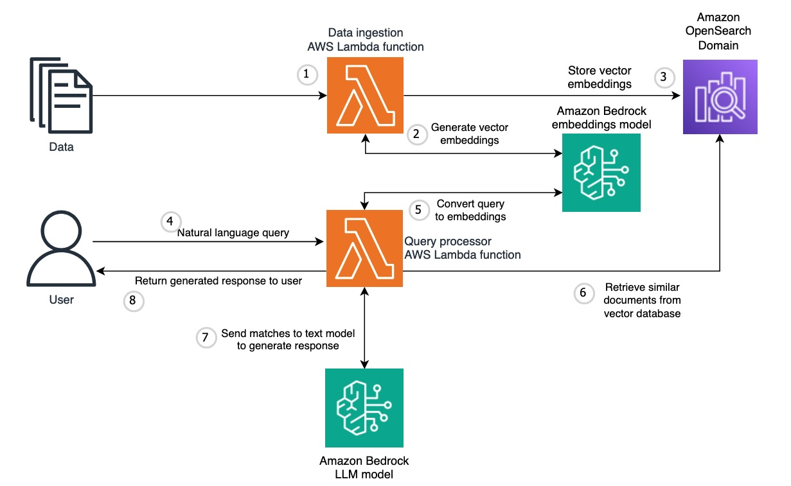
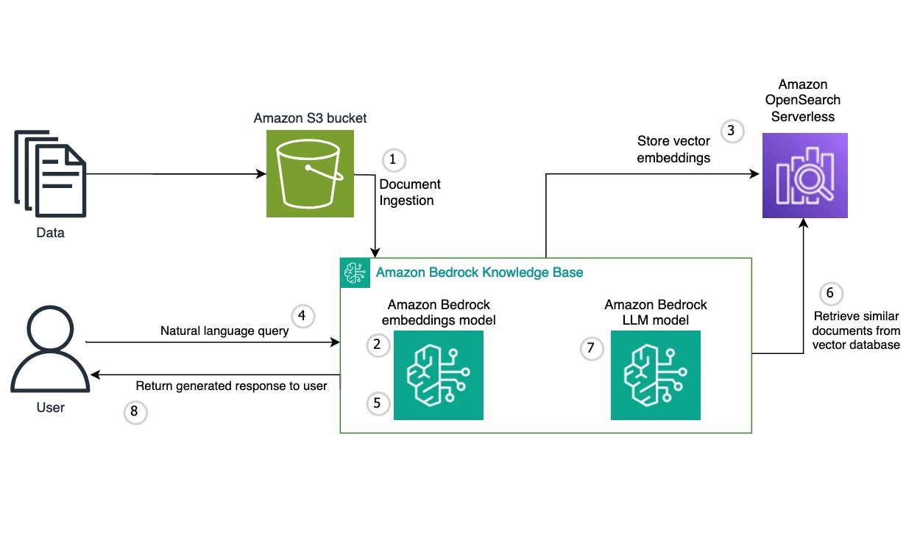

# Multi-tenant vector store using Amazon OpenSearch

Using the vector data store capabilities of Amazon OpenSearch, you can implement semantic search, Retrieval Augmented Generation (RAG) with LLMs, recommendation engines, and search rich media. This sample explores the process of building a multi-tenant vector store using Amazon OpenSearch, describing the necessary steps. We present a self-managed approach to build the vector data store using Amazon OpenSearch domain and also the fully-managed approach using OpenSearch Serverless collection and Amazon Bedrock Knowledge Bases to simplify the integration of the data-sources, vector data store, and your generative AI application.

## Self-Managed Reference Architecture



## Fully-Managed reference Architecture




## Requirements

* [Create an AWS account](https://portal.aws.amazon.com/gp/aws/developer/registration/index.html) if you do not already have one and log in. The IAM user that you use must have sufficient permissions to make necessary AWS service calls and manage AWS resources.
* [AWS CLI](https://docs.aws.amazon.com/cli/latest/userguide/install-cliv2.html) installed and configured
* [Git Installed](https://git-scm.com/book/en/v2/Getting-Started-Installing-Git)

## Deployment Instructions

1. Clone the GitHub repository:
    ``` 
    git clone https://github.com/aws-samples/data-for-saas-patterns.git
    ```
2. Change directory to the CloudFormation template :
    ```
    cd data-for-saas-patterns/samples/multi-tenant-vector-database/amazon-opensearch/cfn
    ```
3. Deploy the CloudFormation stack:
    ```
    aws cloudformation create-stack --stack-name opensearch-stack --template-body file://opensearch-template.yaml --capabilities CAPABILITY_NAMED_IAM --region us-west-2
    ```
    
4. Note the outputs from the CloudFormation stack. These contain resources ARNs and endpoints needed for the notebooks.

5. Review the self-managed approach to build the multi-tenant vector store by using the Jupyter notebook - [opensearch_self_managed_notebook.ipynb](self-managed/opensearch_self_managed_notebook.ipynb)
    ```
    cd data-for-saas-patterns/samples/multi-tenant-vector-database/amazon-opensearch/self-managed 
    ```
6. Review the fully-managed approach to build the multi-tenant vector store using the Jupyter notebook - [opensearch_fully_managed_notebook.ipynb](fully-managed/opensearch_fully_managed_notebook.ipynb)
    ```
    cd data-for-saas-patterns/samples/multi-tenant-vector-database/amazon-opensearch/fully-managed 
    ```
