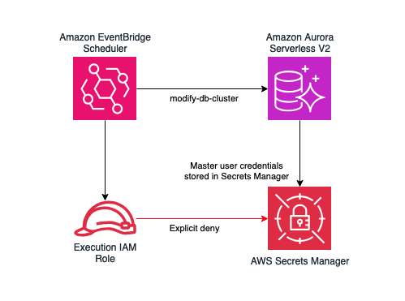

# Scheduled Autoscaling with Amazon Aurora Serverless V2

## What is this sample for?

Amazon Aurora serverless V2 provides automatic vertical scaling of compute resources for PostgreSQL and MySQL relational databases. This automatic scaling can take several minutes to scale, depending on the number of scaling steps that must be taken to provision enough resources to accommodate the load. 

Many SaaS applications follow typical "business day" activity patterns. That is to say they see a ramp up in activity around 9am and see activity begin to trail off around 5pm. An example is shown in the diagram the follows:


By provisioning for peak, the database will be over-provisioned for much of the day, leading to wasted resources. With traditional provisioned databases, this is a downside as you must provision for peak:


By leveraging scheduled autoscaling with Aurora serverless V2, you can use Aurora's automatic scaling in response to changing load for small fluctuations throughout the day, but use the scheduled scaling to preemptively scale enough capacity to meet the defined peaks in usage, increasing database utilization:


It is important to note this scaling behaviour is not instant. It can take several minutes to change the minimum capacity to the desired level, even when explicitly set my modifying the database. As such, you should plan to start your scheduled scaling action with enough time in advance of the capacity being required. 

The higher the minimum or starting ACU and the target ACU, the more quickly and in larger steps Aurora serverless V2 will scale.

This scaling characteristic starting from 0.5, 8 and 32 ACU and scaling to 128 ACU is shown in the next graph:


## Architecture

The scheduled autoscaling sample uses a serverless architecture to schedule and perform the scaling activity. The schedule is managed using Amazon EventBridge. When the cron schedule triggers, this invokves an AWS Lambda function that modifies the database to adjust the min/max ACU to the desired levels. 

**NOTE:** It is important that you use the Secrets Manager integration for managing the RDS master user when using this solution. The `modify-db-cluster` API command used to update the ACU also allows for changing the master user password. To prevent this, the secret should be stored in Secrets Manager and the Lambda function execution role should not have access to this secret. 



## Deploying the sample

### Prerequisites 

This sample does not create the Aurora Serverless V2 instance. You must already have an Amazon Aurora cluster with an Aurora Serverless V2 instance in order to use this solution. 

### Deployment

The sample is implemented using the AWS Cloud Development Kit (CDK). It supports a single "scale up" and/or a single "scale down" schedule, but this is easily extensible by modifying the code. 

Be sure to update the dbClusterId in the `cdk.context.json` file with your cluster ID. You can find this in the AWS management console. 

To define your cron schedule to scale up and down and the min/max for each scaling action, edit the `cdk.context.json` file:

```json
{
    "scheduleUp": "cron(0 8 * * ? *)",
    "desiredCapacityUpMin": "8",
    "desiredCapacityUpMax": "128",
    "scheduleDown": "cron(0 18 * * ? *)",
    "desiredCapacityDownMin": "0.5",
    "desiredCapacityDownMax": "8",
    "dbClusterId": "scalingtarget" //update to your cluster ID
}
```

To deploy the solution:

```
cdk deploy
```

To validate the solution is working, you can check the cluster's scaling configuration using the following AWS CLI command:

```
aws rds describe-db-clusters --db-cluster-identifier myClusterId --query 'DBClusters[].ServerlessV2ScalingConfiguration' --output table
```

Example output:
```
--------------------------------
|      DescribeDBClusters      |
+--------------+---------------+
|  MaxCapacity |  MinCapacity  |
+--------------+---------------+
|  128.0       |  8.0          |
+--------------+---------------+
```

To destroy the solution and remove all resources when you are done:

```
cdk destroy
```